# FarmaTrack — Prototipo funcional

**Entregable de presentación** · Frontend construido sobre mock de datos, contratos idénticos al backend real.

---

## 1. Resumen ejecutivo

FarmaTrack es el sistema de trazabilidad de entregas para una empresa de distribución farmacéutica con varios CEDIs a nivel nacional. Resuelve un problema muy concreto: hoy la facturación se emite *antes* del despacho, sin evidencia real de que el pedido llegó a su destino. FarmaTrack invierte ese orden — la entrega se confirma con firma, foto, cédula del receptor y geolocalización, **y solo entonces se habilita la facturación** — mientras el destinatario final puede seguir su pedido sin necesidad de crear una cuenta.

Este prototipo cubre las 3 superficies del sistema (Portal Web del CEDI, App del Conductor, Portal del Cliente) construidas contra un mock de datos con los mismos contratos que el backend real ya implementado, de modo que conectar la base de datos el día de mañana no requiere tocar ni un componente.

---

## 2. Pantallas construidas

### Portal Web (CEDI / Administración)

**1. Inicio de sesión** — Público (previo a autenticación) · `POST /api/users/login`
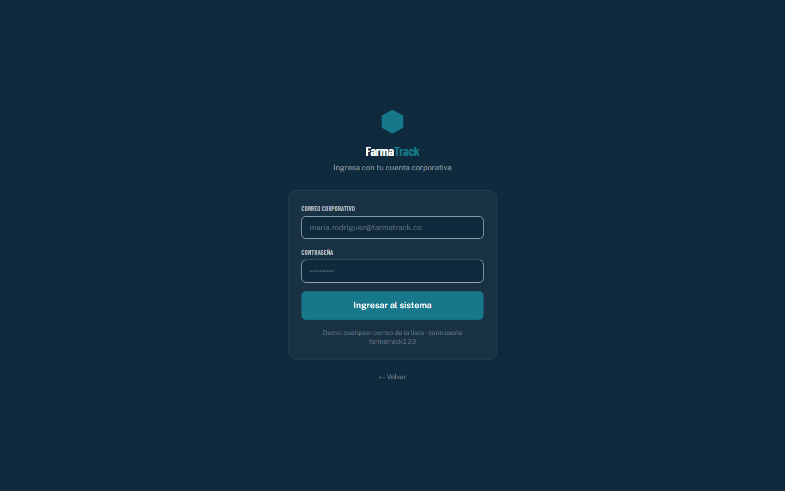

**2. Panel operativo (dashboard)** — ADMIN, CEDI · `GET /api/deliveries`, `GET /api/routes`
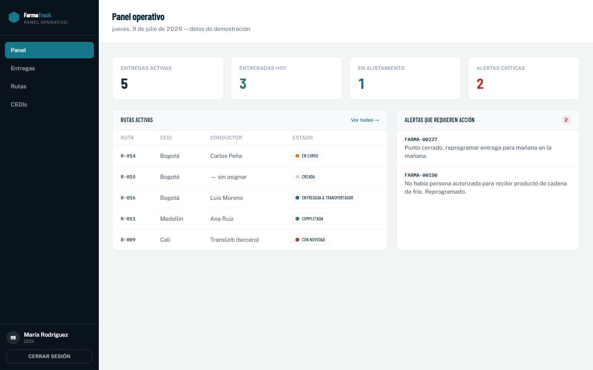

**3. Entregas — listado y filtros** — ADMIN, CEDI · `GET /api/deliveries`
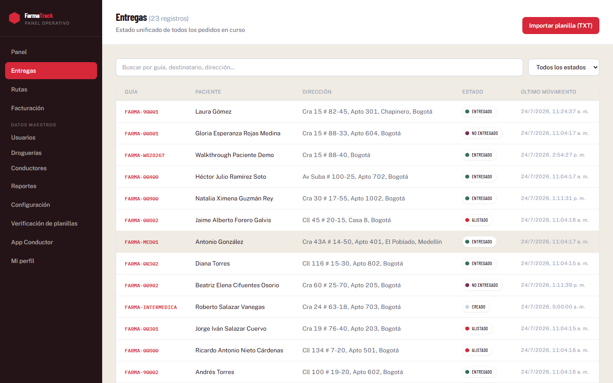

**4. Importar planilla (TXT) — diálogo** — ADMIN, CEDI · `POST /api/txt-import`
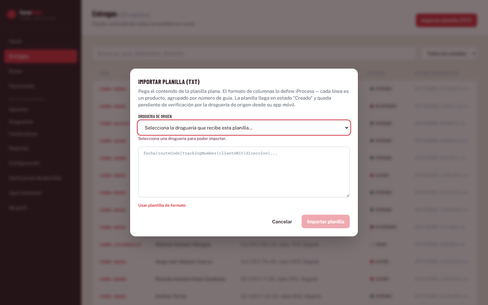

**5. Importar planilla — éxito** — ADMIN, CEDI · `POST /api/txt-import`
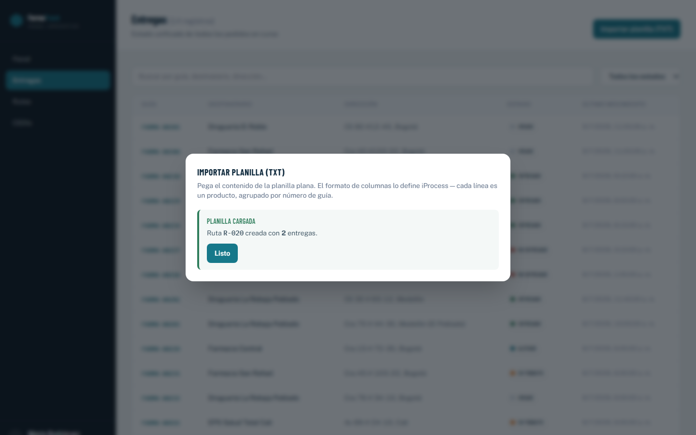

**6. Importar planilla — error (TXT mal formado)** — ADMIN, CEDI · `POST /api/txt-import`
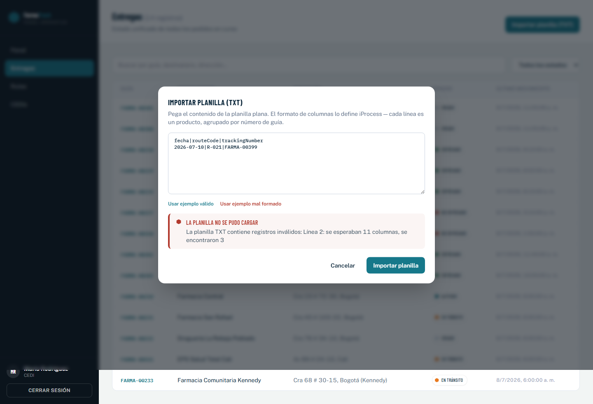

**7. Detalle de entrega** — ADMIN, CEDI · `GET /api/deliveries/:id`
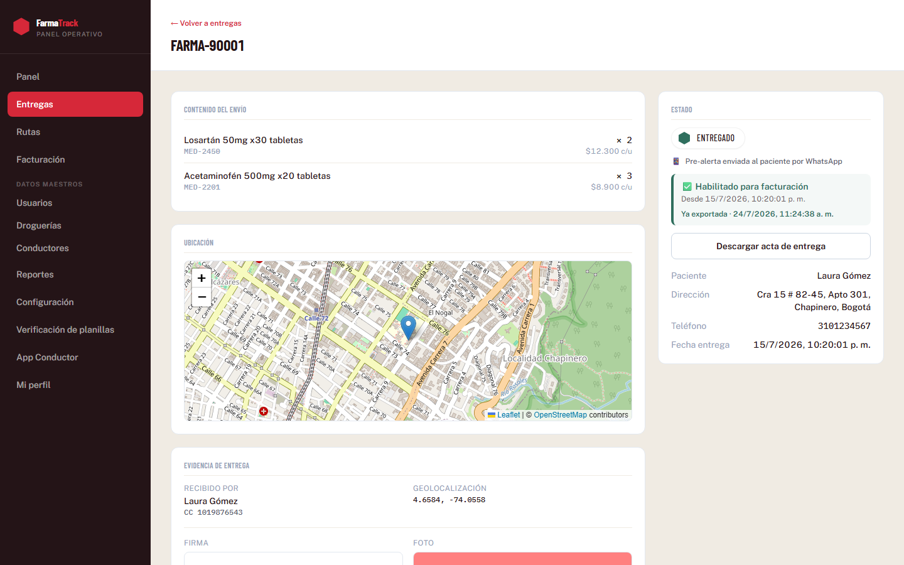

**8. Rutas — asignar conductor / cambiar estado** — ADMIN, CEDI · `GET /api/routes`, `GET /api/users`, `PATCH /api/routes/:id/assign-driver`, `PATCH /api/routes/:id/status`
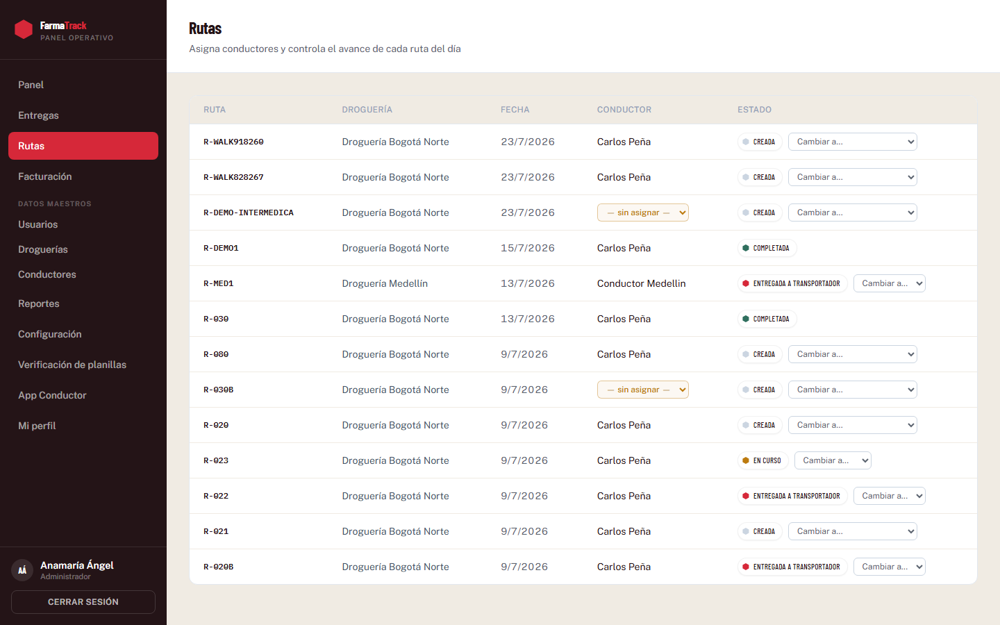

**9. Centros de distribución** — ADMIN, CEDI · `GET /api/distribution-centers`
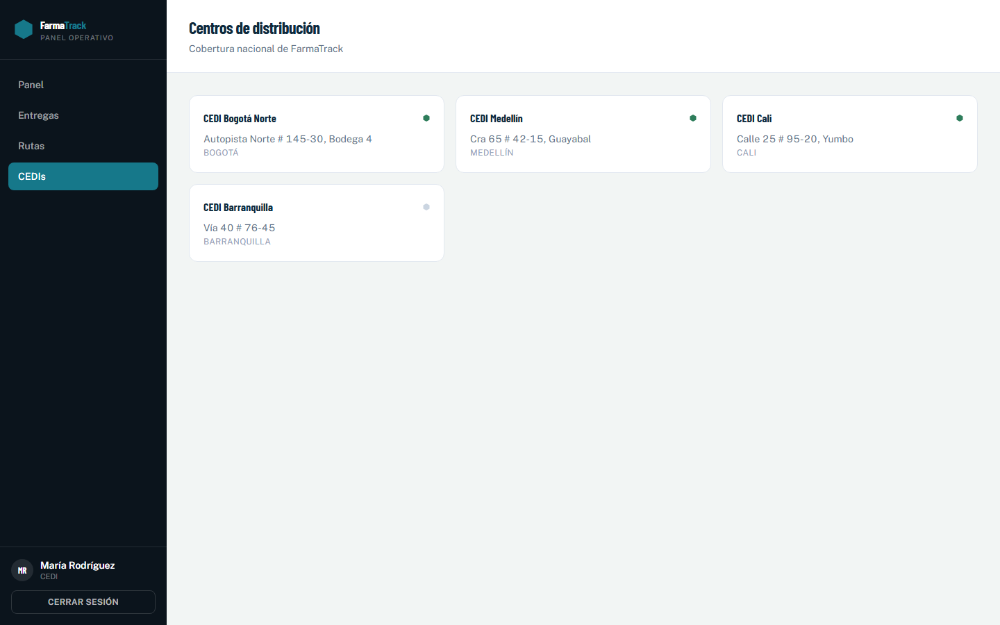

### App Conductor (móvil, campo)

**10. Mi ruta de hoy** — CONDUCTOR · `GET /api/routes?driverId=`, `GET /api/deliveries?routeId=`
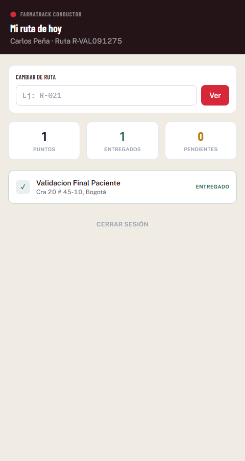

**11. Captura de entrega — recibir para transporte / formulario** — CONDUCTOR · `GET /api/deliveries/:id`, `PATCH /api/deliveries/:id/status`

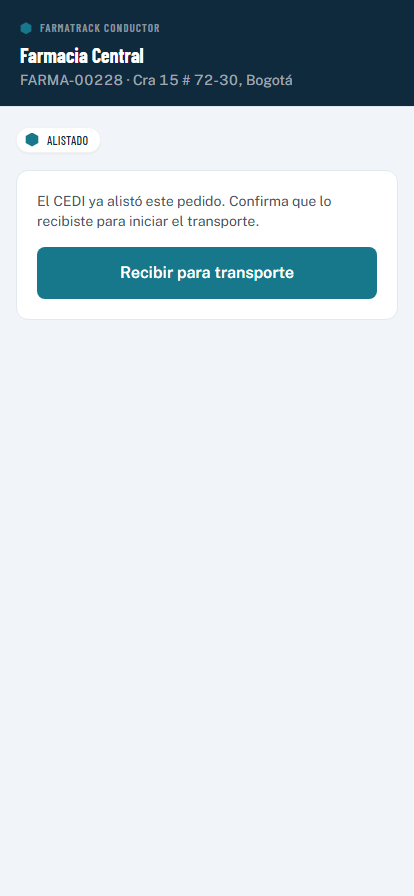
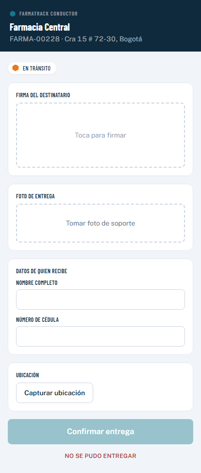

**12. Captura de entrega — firma, foto, receptor, geo** — CONDUCTOR · `POST /api/deliveries/:id/evidence` (o `POST /api/deliveries/:id/not-delivered`)
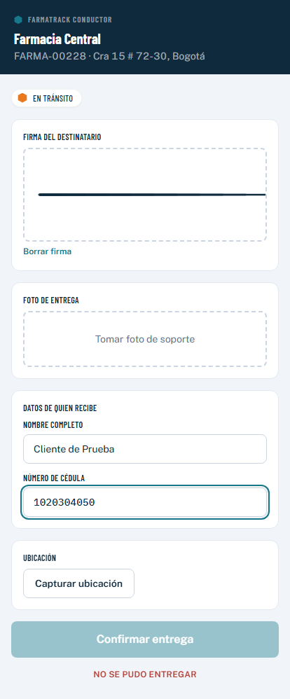

La firma se captura con un canvas real (pointer events), la foto dispara la cámara del dispositivo (`<input capture="environment">`) y la ubicación usa `navigator.geolocation` real del navegador — no son mocks visuales, funcionan de verdad en cualquier teléfono.

### Portal Cliente (público, sin login)

**13. Consulta de pedido** — Público, verificado por guía + teléfono/documento · `GET /portal/my-deliveries/:trackingNumber`
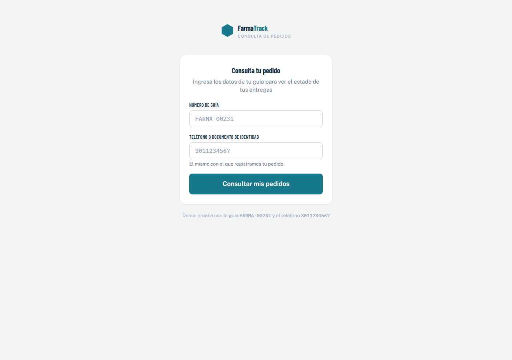

**14. Mis entregas (historial del cliente)** — Público, verificado · `GET /portal/my-deliveries/:trackingNumber`
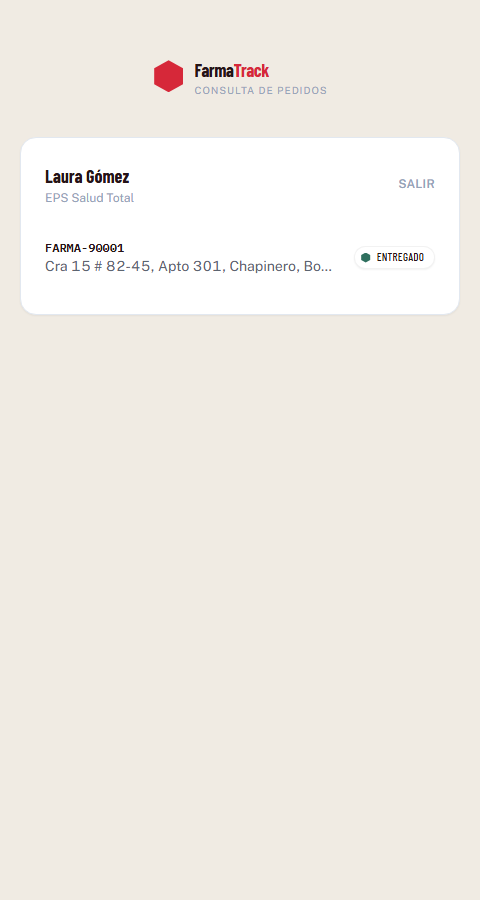

**15. Detalle de guía (sin precios)** — Público, verificado · `GET /portal/deliveries/:trackingNumber`
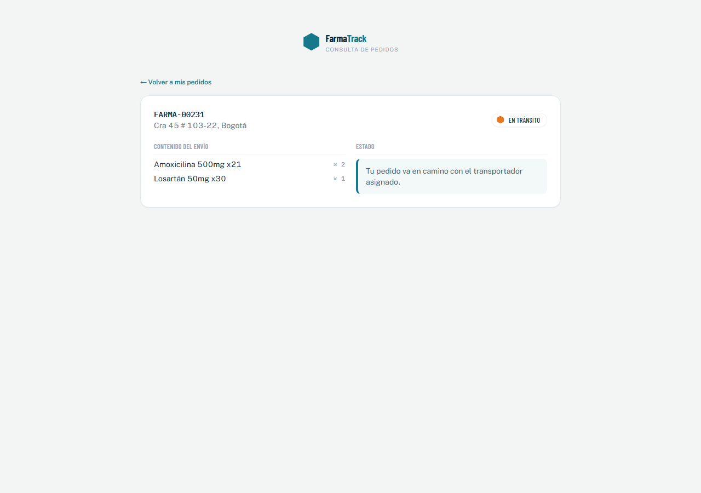

**16. Error — guía no encontrada** — Público · `GET /portal/my-deliveries/:trackingNumber`
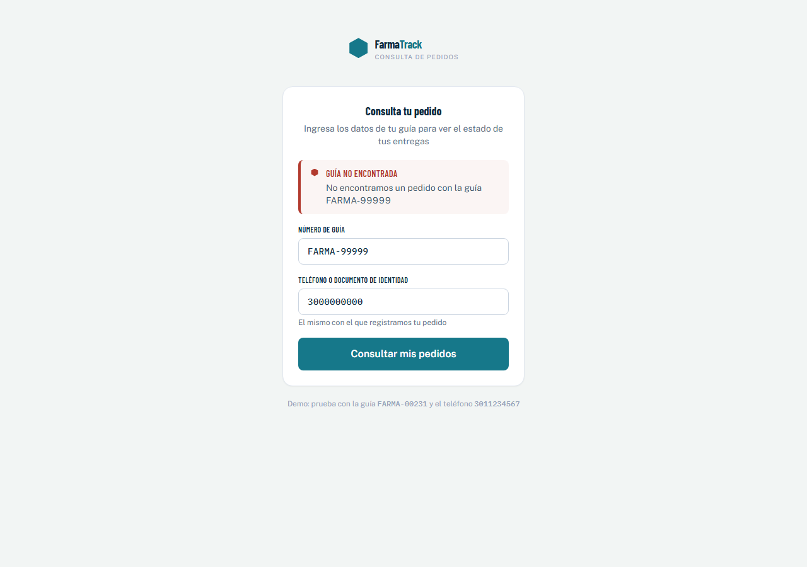

---

## 3. Cobertura funcional

| Funcionalidad | Estado |
|---|---|
| Login unificado (ADMIN/CEDI/CONDUCTOR) con redirección por rol | ✅ Construido |
| Dashboard con KPIs y alertas críticas | ✅ Construido |
| Importar planilla TXT (válida y con error) | ✅ Construido |
| Listado de entregas con búsqueda y filtro por estado | ✅ Construido |
| Detalle de entrega con evidencia y observación | ✅ Construido |
| Asignar conductor a una ruta (independiente del TXT) | ✅ Construido |
| Cambiar estado de ruta respetando transiciones válidas | ✅ Construido |
| Mi ruta del conductor con resumen del día | ✅ Construido |
| Captura real de firma, foto, receptor y geolocalización | ✅ Construido |
| Marcar entrega como no entregada (con observación) | ✅ Construido |
| Portal cliente: cuenta con historial completo por NIT/teléfono | ✅ Construido |
| Portal cliente: detalle sin precios ni datos internos | ✅ Construido |
| Estados de error (login fallido, guía no encontrada, TXT mal formado) | ✅ Construido |
| Escaneo de código de guía por cámara (del mockup) | ⛔ No construido — el conductor ya tiene la lista de guías de su ruta, no es indispensable |
| Mapa en vivo de rutas | ⛔ No construido — no hay librería de mapas integrada |
| Descarga de acta de entrega en PDF / etiqueta QR | ⛔ No construido — no hay generación de documentos |
| Reportes / Configuración (nav del mockup) | ⛔ No construido — sin contrato de API definido para esto |
| UI de facturación (`invoiceExport`) | ⛔ No construido — el endpoint existe en el backend, falta la pantalla |
| CRUD de usuarios/CEDIs desde el panel | ⛔ No construido — solo lectura en este prototipo |
| Cambio de contraseña / OTP | ⛔ No construido — el backend ya lo expone |
| Correo de confirmación de carga exitosa (brief 3.1) | ⛔ Pendiente también en el backend (sin helper de email) |

---

## 4. Próximos pasos: de mock a datos reales

1. **Backend**: levantar MySQL 8.0, generar las llaves RS256 para JWT, correr `npm run db:generate`/migraciones, y arrancar `trazabilidad-api` (`npm run dev`).
2. **Frontend**: en `frontend/.env`, poner `VITE_API_MODE=real` y `VITE_API_BASE_URL=http://localhost:3000` (o la URL real). Ningún componente cambia — solo `src/api/client.ts` conmuta entre `mockApiClient` e `httpApiClient`, que ya está escrito contra los contratos reales.
3. **WhatsApp Business API**: el backend ya dispara el evento de notificación en el helper `whatsappNotifier`; falta conectar un proveedor real (Twilio, Meta Cloud API, etc.) en su implementación.
4. **Email de confirmación de carga** (brief 3.1): no existe helper de correo aún en el backend; es la única pieza genuinamente nueva por construir según el brief original.
5. **Completar lo marcado como pendiente en la tabla anterior**, priorizando según lo que el cliente quiera ver primero (probablemente facturación y reportes).

---

## 5. Stack técnico y decisiones de arquitectura

- **Vite + React 18 + TypeScript estricto** (sin `any`).
- **React Router v6** con un solo árbol de rutas y *guards* por rol (`RequireRole`) — no son 3 apps separadas, es 1 app con 3 conjuntos de rutas y layouts propios (`PanelLayout`, `ConductorLayout`, `PortalLayout`).
- **TanStack Query** para todo el estado de servidor (cache, reintentos, invalidación tras mutaciones) — es lo que hace trivial pasar de mock a real: los componentes no saben si los datos vienen de un `Map` en memoria o de un `fetch`.
- **Zustand + persist** solo para la sesión (token/usuario), sincronizada con `src/api/session.ts`, la misma fuente que leerá el cliente HTTP real para el header `Authorization`.
- **Tailwind CSS + Radix UI primitives**: control total del sistema de diseño propio de FarmaTrack sin pelear con la estética por defecto de un kit de componentes.
- **React Hook Form + Zod**: mismo lenguaje de validación que ya usa el backend (Zod en middleware), pensado para que el equipo piense igual en ambos lados.
- **Capa de API mock/real** (`src/api/`): `apiClient.types.ts` define el contrato único; `mock/mockApiClient.ts` lo implementa en memoria con delay simulado y casos de error reales; `httpApiClient.ts` lo implementa contra el backend real; `client.ts` es el único archivo que decide cuál usar.
- **Sistema de diseño propio** ("sello" hexagonal con muesca como elemento de firma visual en las 3 superficies; paleta anclada en el mundo farmacéutico — teal de cadena de frío, naranja de alerta térmica, verde de dispensación, rojo de medicamento controlado; tipografía Barlow Condensed + Public Sans + IBM Plex Mono, autohospedadas vía `@fontsource`, sin depender de ningún CDN).

---

## Cómo correr el prototipo

```bash
cd frontend
npm install
npm run dev
```

Usuarios de prueba (contraseña `farmatrack123` para todos):
- `maria.rodriguez@farmatrack.co` — CEDI Bogotá Norte
- `carlos.pena@farmatrack.co` — Conductor
- Portal cliente: guía `FARMA-00231` + teléfono `3011234567`
