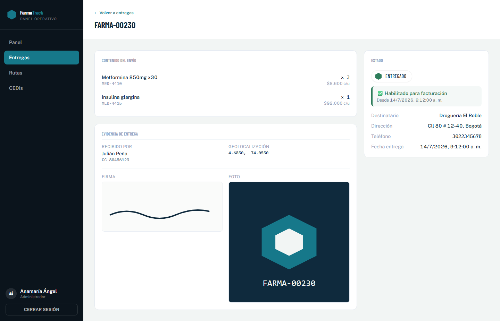
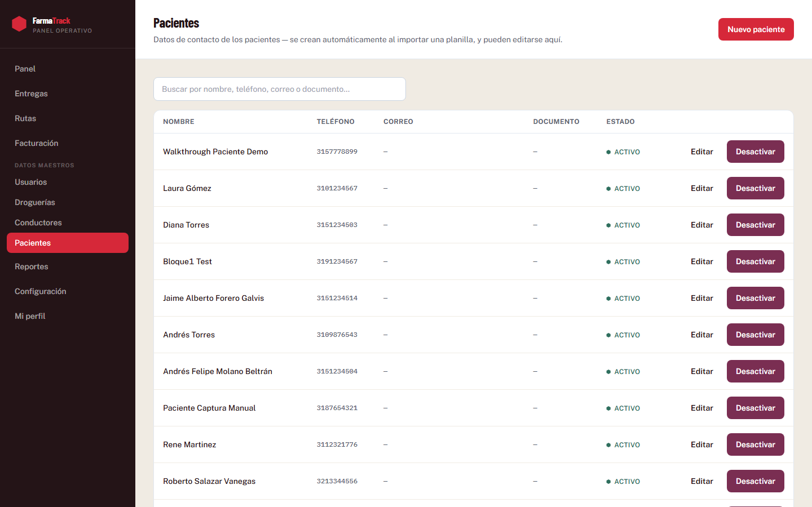
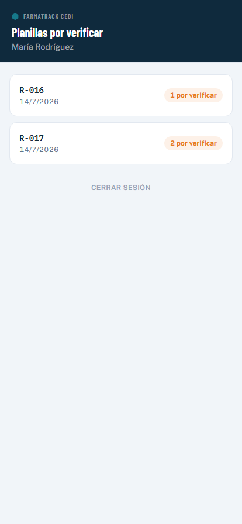
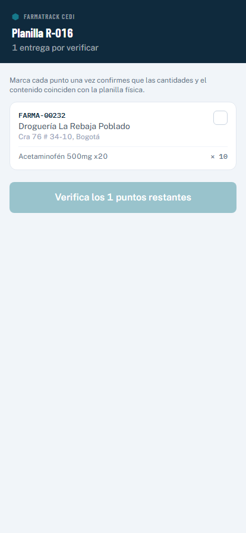
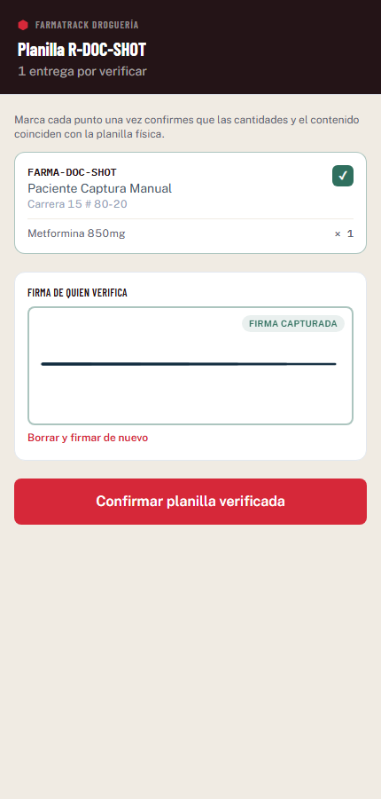
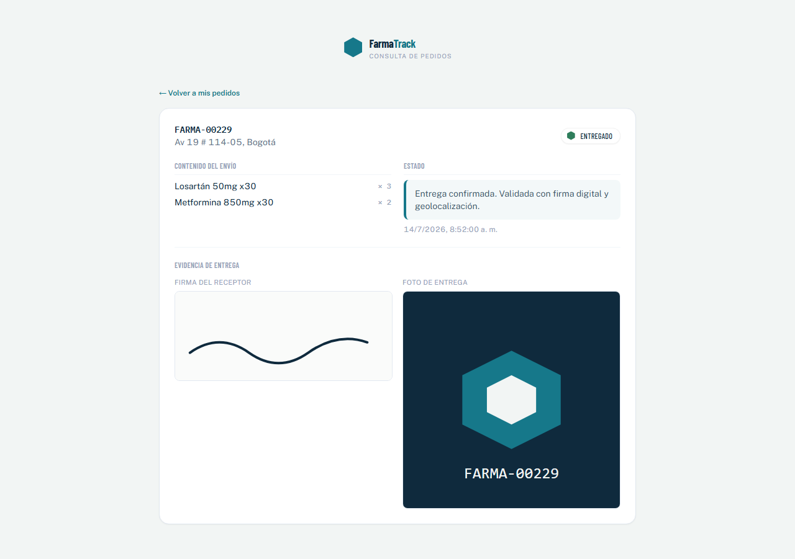

# FarmaTrack — Sistema de trazabilidad de entregas

**Entregable de presentación** · Sistema en producción, backend real (MySQL) sobre arquitectura hexagonal, frontend React desplegado públicamente.

**🔗 Demo en vivo:** **https://farmatrack.syncip.co**
**🔗 API en producción:** backend real (MySQL en Amazon RDS) desplegado en Railway.

---

## 1. Resumen ejecutivo

FarmaTrack es el sistema de trazabilidad de entregas para droguerías que despachan medicamentos directamente al domicilio del paciente. Resuelve un problema muy concreto: hoy la facturación se emite *antes* del despacho, sin evidencia real de que el pedido llegó a su destino. FarmaTrack invierte ese orden — la entrega se confirma con firma, foto, cédula de quien recibe y geolocalización, **y solo entonces se habilita la facturación** — mientras el paciente puede seguir su pedido, ver la evidencia de su propia entrega, y consultarlo sin necesidad de crear una cuenta.

El sistema cubre el flujo **droguería → paciente**: cada droguería despacha sus propios pedidos, un conductor los transporta y confirma la entrega en el domicilio del paciente. Cuando el pedido corresponde a una EPS o convenio, ese dato queda asociado a la entrega de forma opcional — el paciente sigue siendo siempre el destinatario real.

Cubre 4 experiencias, desplegadas públicamente y compartiendo datos en tiempo real entre dispositivos — no es una demo local aislada:

- **Portal Web** — administración completa (rol ADMIN) y operación diaria de cada droguería (rol CEDI).
- **App de verificación** — la droguería confirma que la planilla recibida coincide con lo despachado.
- **App del Conductor** — recibe la ruta, transporta y confirma cada entrega con evidencia.
- **Portal del Paciente** — consulta pública del estado de su pedido, sin necesidad de cuenta.

---

## 2. Flujo de una entrega

**Estado de la entrega** (por guía):
```
Creado ────────(droguería verifica cantidades/contenido)───────▶ Alistado
Alistado ──────(conductor confirma "Recibir para transporte")──▶ Entregado a transportador
Entregado a transportador ──(firma + foto + receptor + geo)────▶ Entregado al paciente ──▶ Habilita facturación
Entregado a transportador ──(conductor marca no entregado)─────▶ No entregado
```

**Estado de la ruta** (el conjunto de guías que un conductor transporta junta):
```
Creada ──(se asigna un conductor)──▶ Asignada ──(conductor recibe la mercancía)──▶ Entregada a transportador ──▶ En curso ──▶ Completada / Con novedad
```

- La planilla llega al sistema en estado **Creado** (importación manual desde el Portal Web, con un código de ruta único). Al abrir la planilla en la app de verificación, el sistema registra automáticamente el **inicio del alistamiento** (sin acción del usuario).
- La **droguería de origen** verifica desde su app móvil que el contenido físico coincide con lo declarado — cada punto de la planilla debe marcarse antes de habilitar la confirmación. Al confirmar, además de marcar cada punto se **captura la firma de quien verifica**, y la entrega pasa a **Alistado** con el timestamp de fin de alistamiento (que también funciona como el momento en que la planilla queda liberada para asignar conductor).
- Antes de asignar un conductor, el sistema exige que **todas las guías de la planilla ya estén verificadas** — no se puede asignar conductor a una planilla con guías todavía en estado Creado.
- Desde el Portal Web se **asigna un conductor** a la ruta — cada droguería solo ve y asigna conductores de su propia sede, y la ruta pasa automáticamente a estado **Asignada**.
- El conductor confirma que recibió la mercancía para transporte, y en el domicilio del paciente captura **firma, foto de soporte, nombre y cédula de quien recibe, y geolocalización real** del punto de entrega.
- Al confirmarse la entrega, el pedido queda **habilitado para facturación** con el timestamp exacto, y se genera automáticamente el acta de entrega descargable en PDF.
- Si el conductor no puede completar la entrega, la marca como **No entregado** con una observación obligatoria.

**Trazabilidad completa:** tanto el detalle de la guía en el Portal Web como el acta en PDF muestran la línea de tiempo completa con sus 4 hitos — creación de la guía, inicio y fin de alistamiento (con la firma de quien verificó), y entrega final al paciente.

---

## 3. Pantallas del sistema

### Portal Web — Administración (rol ADMIN)

**1. Inicio de sesión**


**2. Entregas — listado, búsqueda, filtro por estado, orden por columna y paginación (30 por página)**


**3. Importar planilla (TXT)** — con selector de droguería de destino


**4. Detalle de entrega** — contenido del envío, mapa de ubicación, línea de tiempo completa (creación, inicio/fin de alistamiento con firma del verificador, entrega final) y evidencia de entrega (firma, foto, geolocalización) una vez confirmada


**5. Rutas** — asignar conductor y controlar el avance de cada ruta del día


**6. Facturación** — entregas confirmadas, separadas entre pendientes y ya exportadas a facturación


**7. Droguerías** — crear, editar y desactivar sedes


**8. Usuarios** — crear, editar y desactivar cuentas (ADMIN, CEDI, CONDUCTOR)

**9. Pacientes** — datos de contacto (teléfono, correo, documento) de cada paciente; se crean automáticamente al importar una planilla y pueden editarse aquí — al corregir el teléfono, se actualiza en cascada en todas sus guías


**10. Reportes** — resumen por estado con filtro de rango de fecha y droguería

**11. Configuración** — datos de droguería y umbral de alertas

### App de verificación (rol CEDI — operación diaria de cada droguería)

**12. Planillas por verificar** — por defecto solo se muestran las pendientes, separadas del historial ya verificado


**13. Checklist de verificación** — cada punto de la planilla debe marcarse antes de habilitar la confirmación


**14. Firma de quien verifica** — una vez marcados todos los puntos, se exige la firma de quien verificó antes de confirmar; el sistema registra automáticamente el inicio y fin de esta actividad


### App del Conductor

**15. Mi ruta de hoy** — muestra automáticamente la ruta vigente (la última asignada al conductor), con un buscador para cambiar a otra ruta propia por código si lo necesita; por defecto solo muestra los puntos pendientes, con un botón para ver también los ya completados


**16. Captura de entrega** — recibir para transporte, luego firma, foto, datos de quien recibe y geolocalización real


La firma se captura con un lienzo real (no una imagen genérica), la foto usa la cámara del dispositivo, y la ubicación usa la geolocalización real del navegador en el momento de la entrega — no hay coordenadas simuladas ni de relleno.

### Portal del Paciente (público, sin necesidad de cuenta)

**17. Consulta de pedido** — por número de guía + teléfono, documento o correo


**18. Mis pedidos**


**19. Detalle de guía** — con evidencia de entrega (firma y foto) una vez el pedido fue entregado


---

## 4. Cobertura funcional

| Funcionalidad | Estado |
|---|---|
| Login unificado con redirección según rol (ADMIN / CEDI / CONDUCTOR) | ✅ |
| Verificación de planilla en la droguería de origen (Creado → Alistado) | ✅ |
| Selector de droguería de destino al importar planilla | ✅ |
| Asignar conductor a una ruta (acotado a la propia droguería), avanza el estado a Asignada | ✅ |
| Código de ruta único en todo el sistema (validado al importar) | ✅ |
| Conductor ve automáticamente su ruta vigente, con buscador manual por código | ✅ |
| Cambiar estado de ruta respetando las transiciones válidas | ✅ |
| Captura real de firma, foto, receptor y geolocalización | ✅ |
| Marcar entrega como no entregada, con observación obligatoria | ✅ |
| Habilitación automática de facturación al confirmar la entrega | ✅ |
| Exportación a facturación desde el Portal Web | ✅ |
| Descarga de acta de entrega en PDF (con código QR de la guía) | ✅ |
| Mapa de ubicación por entrega (destino declarado + punto real de entrega) | ✅ |
| Portal del paciente: consulta sin cuenta, historial completo por guía + teléfono/documento | ✅ |
| Campo opcional de EPS/convenio asociado a la entrega (paciente sigue siendo el destinatario) | ✅ |
| CRUD de usuarios y droguerías desde el panel | ✅ |
| Cambio de contraseña / recuperación por código (OTP en pantalla) | ✅ |
| Reportes por estado, con filtro de fecha y droguería | ✅ |
| Configuración de droguería y umbral de alertas | ✅ |
| Permisos por rol validados en backend (no solo ocultos en la interfaz) | ✅ |
| Gestión de pacientes (teléfono, correo, documento) con sincronización en cascada a sus guías | ✅ |
| Acceso al Portal del Paciente también por correo (además de teléfono/documento) | ✅ |
| Firma de quien verifica en el CDI + registro automático de inicio/fin de alistamiento | ✅ |
| Línea de tiempo completa (creación, alistamiento, entrega) en el detalle de guía y en el acta PDF | ✅ |
| Orden dinámico por columna y paginación (30 por página) en el listado de Entregas | ✅ |
| Vista de CDI separada en pendientes de verificación / historial | ✅ |
| Vista del conductor oculta por defecto las entregas ya completadas | ✅ |
| No se puede asignar conductor a una planilla con guías sin verificar | ✅ |
| Notificación por WhatsApp al paciente | ⛔ Evento ya se dispara; falta conectar un proveedor real |
| Correo de confirmación de carga exitosa | ⛔ Pendiente, sin proveedor de correo conectado |
| Proveedor real de OTP/SMS | ⛔ El código de recuperación se muestra en pantalla, sin envío real |

---

## 5. Stack técnico

- **Backend**: Node.js + TypeScript, arquitectura hexagonal (casos de uso, entidades de dominio, repositorios), Express, Drizzle ORM sobre MySQL 8 (Amazon RDS), autenticación JWT (RS256).
- **Frontend**: Vite + React 18 + TypeScript estricto, React Router con *guards* por rol, TanStack Query (cache + actualización en vivo por polling), Zustand (sesión), Tailwind + Radix UI, React Hook Form + Zod.
- **Mapa**: `react-leaflet` + OpenStreetMap, sin necesidad de llave de API.
- **Despliegue**: backend y frontend en **Railway**, frontend servido bajo dominio propio (`farmatrack.syncip.co`).
- **Sistema de diseño propio**: "sello" hexagonal con muesca como elemento de firma visual; paleta anclada en el mundo farmacéutico; tipografía Barlow Condensed + Public Sans + IBM Plex Mono, autohospedadas.

---

## 6. Próximos pasos

1. **Proveedor real de WhatsApp Business API** (Twilio o Meta Cloud API) — el sistema ya dispara el evento de notificación al paciente en cada cambio de estado relevante, falta conectarlo a un proveedor real de envío.
2. **Proveedor real de correo y SMS** — para la confirmación de carga de planilla y el envío real del código de recuperación de contraseña (hoy se muestra en pantalla).
3. **Umbral de alertas configurable** — hoy se guarda desde la pantalla de Configuración pero aún no dispara ninguna alerta automática; falta conectarlo a una regla de negocio.

---

## Cómo acceder

**En producción:** https://farmatrack.syncip.co

Usuarios de prueba (contraseña `Farmatrack2026!` para todos):

| Rol | Nombre | Correo | Droguería |
|---|---|---|---|
| ADMIN | Administrador | `admin@farmatrack.co` | Acceso completo |
| CEDI | María Rodríguez | `maria.rodriguez@farmatrack.co` | Droguería Bogotá Norte |
| CONDUCTOR | Carlos Peña | `carlos.pena@farmatrack.co` | Droguería Bogotá Norte |
| CONDUCTOR | — | `conductor.medellin@test.com` | Droguería Medellín |

Nota de menú: el Portal Web ya no muestra "App Conductor" ni "Verificación de planillas" como accesos directos para ADMIN — son pantallas pensadas para el celular de CEDI y CONDUCTOR, que sí las conservan en su propio menú.

**Portal del paciente** (consulta por guía + teléfono, documento o correo, sin necesidad de contraseña):

| Guía | Acceso | Estado |
|---|---|---|
| `FARMA-DOC-CREADO` | teléfono `3201234567` | Creado |
| `FARMA-90001` | teléfono `3101234567` | Entregado, con evidencia completa |
| `FARMA-00801` | teléfono `3151234513` | No entregado |
| `FARMA-00300` | correo `diana.torres.test@example.co` | Alistado (ejemplo de acceso por correo) |
